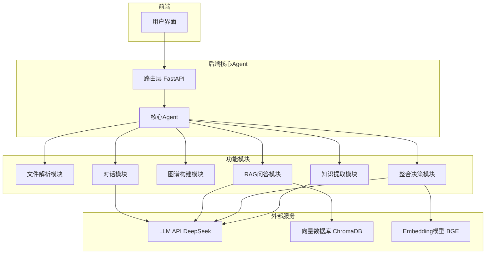

# Agent架构说明

## 1. 架构总览

### 1.1 设计选择

本项目采用**单Agent架构**，而非多Agent协作架构。

### 1.2 架构图



### 1.3 核心Agent职责

核心Agent作为统一调度中心，负责：
- 接收前端请求
- 路由到对应功能模块
- 协调模块间数据流转
- 管理对话上下文

---

## 2. 设计决策论证

### 2.1 为什么选择单Agent架构？

| 因素 | 单Agent优势 | 多Agent劣势 |
|------|-------------|-------------|
| **开发时间** | 5小时限制下，单Agent更简单快速 | 多Agent需要设计通信协议，时间成本高 |
| **任务性质** | 功能模块间无复杂协作需求 | 无真正意义上的"协作"场景 |
| **调试难度** | 单一入口，问题定位容易 | 多Agent交互复杂，调试困难 |
| **论证成本** | 论证"为什么不拆分"更直接 | 论证"为什么拆分"需要证明协作价值 |

### 2.2 Prompt复杂度管理策略

单Agent面临Prompt过长问题，采用以下策略管理：

1. **模块化Prompt**：每个功能模块独立Prompt模板
2. **分步调用**：不一次性注入所有上下文，按需加载
3. **上下文压缩**：对话历史只保留关键信息摘要
4. **结构化输出约束**：JSON格式约束，减少冗余描述

### 2.3 不拆分多Agent的原因

多Agent架构常见于以下场景：
- 多个Agent需要并行工作
- Agent间需要复杂的协商和投票
- 任务可以自然分解为独立子任务

本项目不满足以上条件：
- 各模块串行执行，无并行需求
- 无协商场景，整合决策由用户确认
- 模块间数据依赖强，不适合独立运行

---

## 3. 数据流与调用链路

### 3.1 教材上传 → 图谱构建链路

```
用户上传文件
    ↓
FastAPI接收请求
    ↓
核心Agent路由到文件解析模块
    ↓
解析PDF → 结构化数据
    ↓
路由到知识提取模块
    ↓
分章节调用LLM → 知识点JSON
    ↓
路由到图谱构建模块
    ↓
构建节点/边 → 返回前端渲染
```

### 3.2 RAG问答链路

```
用户输入问题
    ↓
核心Agent路由到RAG模块
    ↓
问题 → Embedding向量
    ↓
ChromaDB检索top-5 chunks
    ↓
构建Prompt（chunks + 问题）
    ↓
调用LLM生成回答
    ↓
附加引用来源 → 返回前端
```

### 3.3 整合决策链路

```
用户选择多本教材整合
    ↓
核心Agent路由到整合决策模块
    ↓
加载各教材知识点列表
    ↓
计算Embedding相似度矩阵
    ↓
高置信度直接合并
    ↓
中置信度调用LLM二次判断
    ↓
生成整合决策列表 → 返回前端
    ↓
用户确认 → 执行整合 → 更新图谱
```

---

## 4. RAG Pipeline设计

### 4.1 分块策略

| 参数 | 值 | 选择依据 |
|------|-----|----------|
| 块大小 | 600字 | 中文教材段落通常300-500字，600字可覆盖完整段落 |
| 重叠区 | 80字 | 约一个短句长度，防止知识点截断 |
| 分块方式 | 按段落优先 | 保持语义完整性 |

### 4.2 Embedding选择

选择 **BGE-small-zh-v1.5**：
- 模型大小：约100MB
- 中文语义能力：优于multilingual模型
- 推理速度：本地运行，无需API调用

### 4.3 检索策略

```python
# 基础向量检索
def retrieve_chunks(question_embedding, top_k=5):
    results = collection.query(
        query_embeddings=[question_embedding],
        n_results=top_k
    )
    return results

# 可选：混合检索（加分项）
def hybrid_retrieve(question, top_k=5):
    # 向量检索
    vector_results = vector_search(question, top_k=10)
    # BM25关键词检索
    bm25_results = bm25_search(question, top_k=10)
    # 合并去重后rerank
    merged = merge_and_rerank(vector_results, bm25_results)
    return merged[:top_k]
```

### 4.4 Prompt模板

```
你是一个学科知识助手，只能基于提供的教材内容回答问题。

【教材内容】
{chunks}

【问题】
{question}

【回答要求】
1. 只基于上述教材内容回答，不使用自身知识
2. 每个回答必须附带来源引用，格式：[教材名, 章节, 页码]
3. 如果找不到答案，回复"当前知识库中未找到相关信息"

请回答：
```

---

## 5. Prompt工程

### 5.1 知识点提取Prompt

```
从以下章节内容中提取核心知识点。

【章节内容】
{chapter_content}

【提取要求】
1. 提取核心概念、定理、方法、现象等知识点
2. 每个知识点包含：name（名称）、definition（定义）、category（类型）
3. 识别知识点间的关系（前置依赖/并列/包含/应用）

【输出格式】
严格输出JSON，格式如下：
{
  "nodes": [
    {"id": "n1", "name": "...", "definition": "...", "category": "..."}
  ],
  "edges": [
    {"source": "n1", "target": "n2", "relation_type": "...", "description": "..."}
  ]
}

【示例】
输入："动作电位是细胞膜电位快速倒转..."
输出：
{
  "nodes": [{"id": "n1", "name": "动作电位", "definition": "细胞膜电位快速倒转...", "category": "核心概念"}],
  "edges": [{"source": "n1", "target": "n2", "relation_type": "prerequisite", "description": "需要先理解静息电位"}]
}

请输出：
```

### 5.2 整合判断Prompt

```
判断以下两个知识点是否为同一概念。

【知识点A】
名称：{name_a}
定义：{definition_a}
来源：{textbook_a}

【知识点B】
名称：{name_b}
定义：{definition_b}
来源：{textbook_b}

【判断标准】
1. 核心含义是否相同（即使表述不同）
2. 是否只是命名差异（如"白细胞"与"leukocyte"）
3. 是否存在实质内容差异

【输出格式】
{
  "is_same": true/false,
  "reason": "判断理由",
  "recommendation": "merge/keep/remove"
}

请判断：
```

### 5.3 防幻觉策略

1. **约束来源**：明确要求"只基于提供的上下文"
2. **拒绝策略**：找不到时必须明确说"未找到"
3. **引用强制**：每个回答必须有引用支撑
4. **Few-shot示例**：展示正确引用格式

---

## 6. 取舍与权衡

### 6.1 放弃的方案

| 方案 | 放弃原因 |
|------|----------|
| 多Agent架构 | 5小时内论证和实现成本过高，无真实协作需求 |
| LangGraph框架 | 学习成本高，简单路由用FastAPI足够 |
| 复杂图谱算法 | Embedding相似度已能满足对齐需求 |
| 混合检索+Rerank | 时间不够，基础向量检索已满足验收标准 |

### 6.2 已知局限

1. **图谱对齐精度**：Embedding相似度可能误判相关但不同的概念
2. **大文件性能**：超大型教材（500页+）解析较慢
3. **跨语言对齐**：中英文混合教材对齐效果待验证
4. **实时性**：整合决策生成需等待LLM调用，响应时间较长

### 6.3 改进方向

如果有更多时间：
1. 引入LLM二次判断提高对齐精度
2. 实现混合检索+Rerank提升RAG效果
3. 添加图谱可视化对比功能
4. 自建RAG Benchmark数据驱动优化

---

## 7. 创新点说明

### 7.1 实现的创新功能

| 创新点 | 实现方式 | 效果 |
|--------|----------|------|
| Token消耗统计 | API调用时记录token数，前端展示 | 便于成本控制和优化分析 |
| 图谱搜索 | 前端关键词搜索，高亮匹配节点 | 提升用户查找效率 |
| 教材来源颜色区分 | 不同教材节点使用不同颜色 | 直观展示知识点来源 |

### 7.2 创新价值

- Token统计帮助用户了解API成本，做出合理调用决策
- 图谱搜索提升大图谱场景下的使用效率
- 来源颜色区分增强知识图谱的可读性