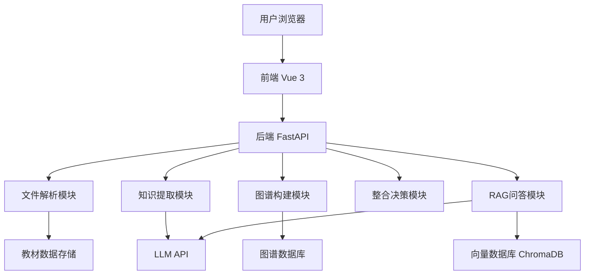
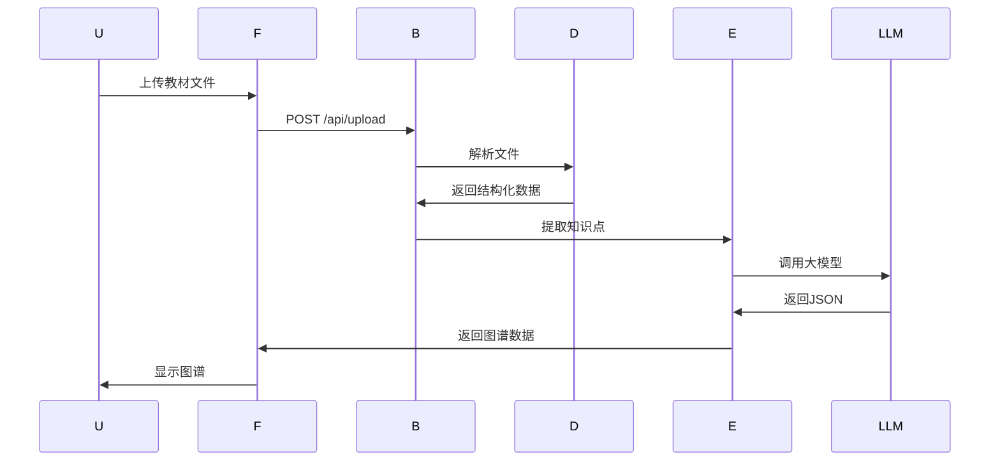
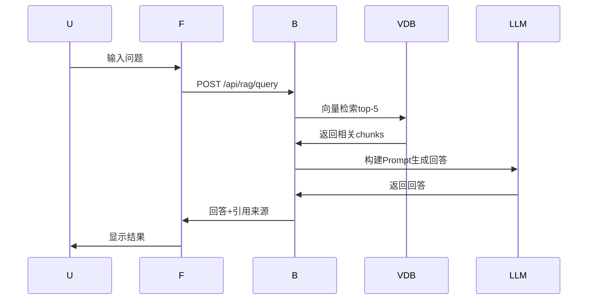
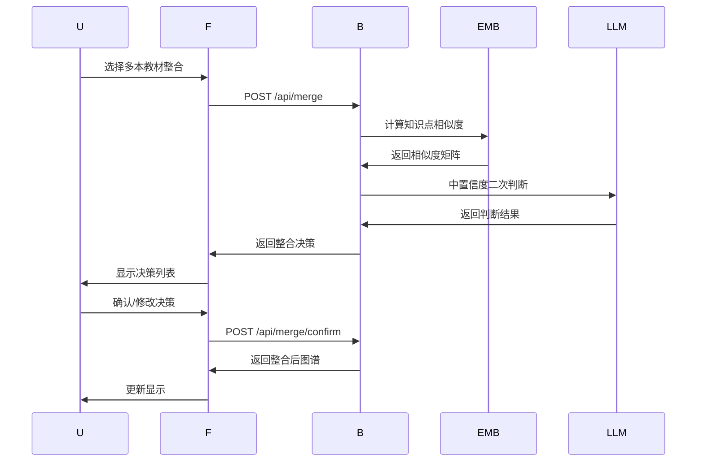

# 系统设计

## 1. 系统架构总览

### 1.1 整体架构

采用前后端分离架构，后端FastAPI提供API服务，前端Vue 3 + AntV G6实现交互界面。



### 1.2 技术选型

| 层级 | 技术 | 选型理由 |
|------|------|----------|
| 后端框架 | FastAPI | 高性能异步、自动API文档、Python生态 |
| 前端框架 | Vue 3 | 轻量灵活、组件化开发 |
| 图谱可视化 | AntV G6 | 图谱功能丰富、中文文档完善 |
| 大模型 | DeepSeek API | 便宜快速、中文能力强 |
| 向量嵌入 | BGE-small-zh | 免费、中文效果好、本地运行 |
| 向量检索 | ChromaDB | 轻量级、无需额外服务、Python集成好 |
| 文件解析 | PyMuPDF | PDF解析能力强、支持大文件 |

---

## 2. 模块设计

### 2.1 文件解析模块

**职责**：解析多种格式教材，统一输出结构化数据

**输入**：上传的教材文件（PDF/MD/TXT/DOCX）

**输出**：结构化教材数据

```json
{
  "textbook_id": "book_01",
  "filename": "生理学.pdf",
  "title": "生理学",
  "total_pages": 520,
  "total_chars": 385000,
  "chapters": [
    {
      "chapter_id": "ch_01",
      "title": "第一章 绪论",
      "page_start": 1,
      "page_end": 15,
      "content": "...",
      "char_count": 8500
    }
  ]
}
```

**核心流程**：
1. 接收上传文件
2. 判断文件格式
3. 调用对应解析器
4. 提取章节结构
5. 返回结构化数据

### 2.2 知识提取模块

**职责**：调用LLM提取知识点和关系

**输入**：章节内容

**输出**：知识点列表和关系列表

```json
{
  "nodes": [
    {
      "id": "node_001",
      "name": "动作电位",
      "definition": "...",
      "category": "核心概念",
      "chapter": "第二章",
      "page": 35
    }
  ],
  "edges": [
    {
      "source": "node_001",
      "target": "node_002",
      "relation_type": "prerequisite",
      "description": "..."
    }
  ]
}
```

**核心流程**：
1. 分章节调用LLM
2. Prompt约束JSON输出
3. 解析LLM返回结果
4. 存储到图谱数据库

### 2.3 图谱构建模块

**职责**：构建单本教材知识图谱

**输入**：知识点和关系数据

**输出**：可视化图谱数据

**核心流程**：
1. 接收知识提取结果
2. 构建节点和边列表
3. 计算节点位置（力导向布局）
4. 返回前端渲染数据

### 2.4 整合决策模块

**职责**：跨教材知识图谱整合

**输入**：多本教材的知识图谱

**输出**：整合决策列表 + 整合后图谱

**核心流程**：
1. 计算知识点间Embedding相似度
2. 高置信度（≥0.85）直接合并
3. 中置信度（0.70-0.85）LLM二次判断
4. 生成整合决策
5. 执行合并/保留/删除操作
6. 统计压缩比

### 2.5 RAG问答模块

**职责**：基于教材内容的精准问答

**输入**：用户问题

**输出**：回答 + 引用来源

**核心流程**：
1. 问题转Embedding向量
2. 检索top-5相关chunk
3. 构建Prompt（上下文+问题）
4. 调用LLM生成回答
5. 附带引用来源返回

---

## 3. 数据流设计

### 3.1 教材上传流程



### 3.2 RAG问答流程



### 3.3 整合决策流程



---

## 4. API接口设计

### 4.1 教材管理接口

| 接口 | 方法 | 说明 |
|------|------|------|
| `/api/upload` | POST | 上传教材文件 |
| `/api/textbooks` | GET | 获取已上传教材列表 |
| `/api/textbooks/{id}` | GET | 获取单本教材详情 |
| `/api/textbooks/{id}/graph` | GET | 获取教材知识图谱 |

**请求示例**：

```bash
# 上传教材
POST /api/upload
Content-Type: multipart/form-data
file: 生理学.pdf

# 响应
{
  "textbook_id": "book_01",
  "filename": "生理学.pdf",
  "status": "parsed",
  "chapters_count": 15
}
```

### 4.2 知识图谱接口

| 接口 | 方法 | 说明 |
|------|------|------|
| `/api/graph/{textbook_id}` | GET | 获取单本教材图谱 |
| `/api/graph/merged` | GET | 获取整合后图谱 |
| `/api/node/{id}` | GET | 获取知识点详情 |

**响应示例**：

```json
{
  "nodes": [
    {"id": "n1", "name": "动作电位", "definition": "...", "freq": 3}
  ],
  "edges": [
    {"source": "n1", "target": "n2", "type": "prerequisite"}
  ]
}
```

### 4.3 整合接口

| 接口 | 方法 | 说明 |
|------|------|------|
| `/api/merge` | POST | 执行跨教材整合 |
| `/api/merge/decisions` | GET | 获取整合决策列表 |
| `/api/merge/confirm` | POST | 确认整合决策 |
| `/api/merge/modify` | POST | 修改整合决策 |

**请求示例**：

```bash
POST /api/merge
{
  "textbook_ids": ["book_01", "book_02", "book_03"]
}

# 响应
{
  "decisions": [...],
  "compression_ratio": 0.25,
  "original_chars": 1000000,
  "merged_chars": 250000
}
```

### 4.4 RAG问答接口

| 接口 | 方法 | 说明 |
|------|------|------|
| `/api/rag/index` | POST | 建立向量索引 |
| `/api/rag/query` | POST | 问答查询 |
| `/api/rag/status` | GET | 查询索引状态 |

**请求示例**：

```bash
POST /api/rag/query
{
  "question": "什么是动作电位？"
}

# 响应
{
  "answer": "动作电位是...",
  "citations": [
    {
      "textbook": "生理学",
      "chapter": "第二章",
      "page": 35,
      "relevance_score": 0.92
    }
  ]
}
```

### 4.5 对话接口

| 接口 | 方法 | 说明 |
|------|------|------|
| `/api/chat` | POST | 发送对话消息 |
| `/api/chat/history` | GET | 获取对话历史 |

---

## 5. 数据存储设计

### 5.1 教材数据存储

```
data/
├── textbooks/
│   ├── book_01/
│   │   ├── parsed.json    # 解析后的结构化数据
│   │   ├── raw_content/   # 原始内容分段
│   │   └── chunks.json    # RAG分块数据
│   └── book_02/
│   └── ...
├── graphs/
│   ├── book_01_graph.json
│   ├── merged_graph.json
│   └── decisions.json
├── embeddings/
│   └── chroma_db/         # ChromaDB向量数据
```

### 5.2 ChromaDB配置

```python
import chromadb

client = chromadb.PersistentClient(path="./data/embeddings/chroma_db")
collection = client.create_collection(
    name="textbook_chunks",
    metadata={"hnsw:space": "cosine"}
)
```

---

## 6. 前端设计

### 6.1 页面布局

```
┌─────────────────────────────────────────────────────────┐
│                        顶部导航                          │
├────────────┬──────────────────────────┬─────────────────┤
│            │                          │                 │
│  教材管理   │     知识图谱可视化区       │    功能面板     │
│  (左侧)    │      (中间 - 最大面积)     │    (右侧)      │
│            │                          │  ┌───────────┐  │
│ ┌────────┐ │                          │  │ 整合操作  │  │
│ │ 上传区 │ │                          │  ├───────────┤  │
│ ├────────┤ │                          │  │ RAG问答   │  │
│ │ 教材列表│ │                          │  ├───────────┤  │
│ │        │ │                          │  │ 对话交互  │  │
│ │        │ │                          │  ├───────────┤  │
│ └────────┘ │                          │  │ 整合报告  │  │
│            │                          │  └───────────┘  │
└────────────┴──────────────────────────┴─────────────────┘
```

### 6.2 组件划分

| 组件 | 职责 |
|------|------|
| UploadZone | 文件上传区域，支持拖拽和点击 |
| TextbookList | 已上传教材列表，显示解析状态 |
| GraphCanvas | 知识图谱可视化画布 |
| NodeDetail | 知识点详情弹窗/侧边栏 |
| FunctionPanel | 右侧功能面板容器 |
| MergePanel | 整合操作面板 |
| RAGPanel | RAG问答面板 |
| ChatPanel | 对话交互面板 |
| ReportPanel | 整合报告面板 |

---

## 7. 安全设计

### 7.1 API密钥管理

- 所有API密钥通过环境变量配置
- 不在代码中硬编码密钥
- .env文件不上传GitHub

### 7.2 文件上传安全

- 限制文件类型（仅PDF/MD/TXT/DOCX）
- 限制单文件大小（≤100MB）
- 文件名过滤特殊字符

### 7.3 输入验证

- 所有API输入进行类型验证
- 防止SQL注入、命令注入

---

## 8. 性能优化

### 8.1 大文件处理

- PDF逐页解析，不一次性加载
- 分批调用LLM，避免超长Prompt

### 8.2 向量检索优化

- ChromaDB使用HNSW索引
- Top-5检索，减少计算量

### 8.3 缓存策略

- 已解析教材数据缓存
- 图谱数据缓存
- Embedding结果缓存